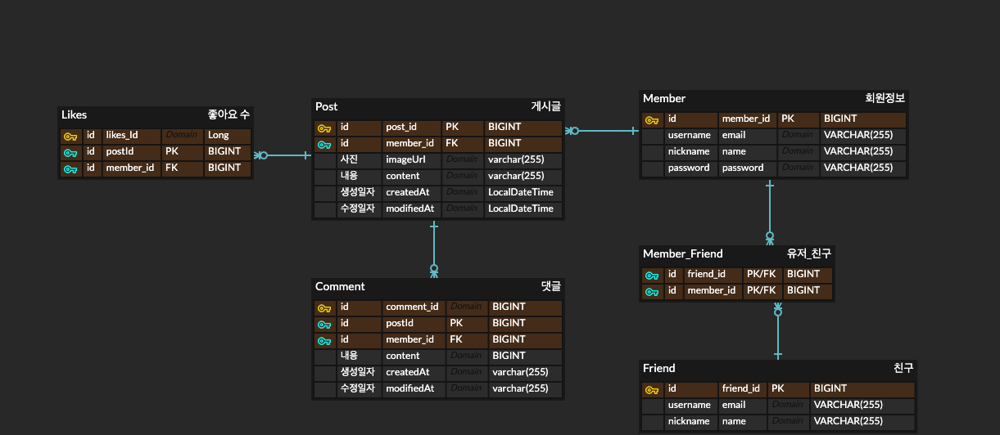
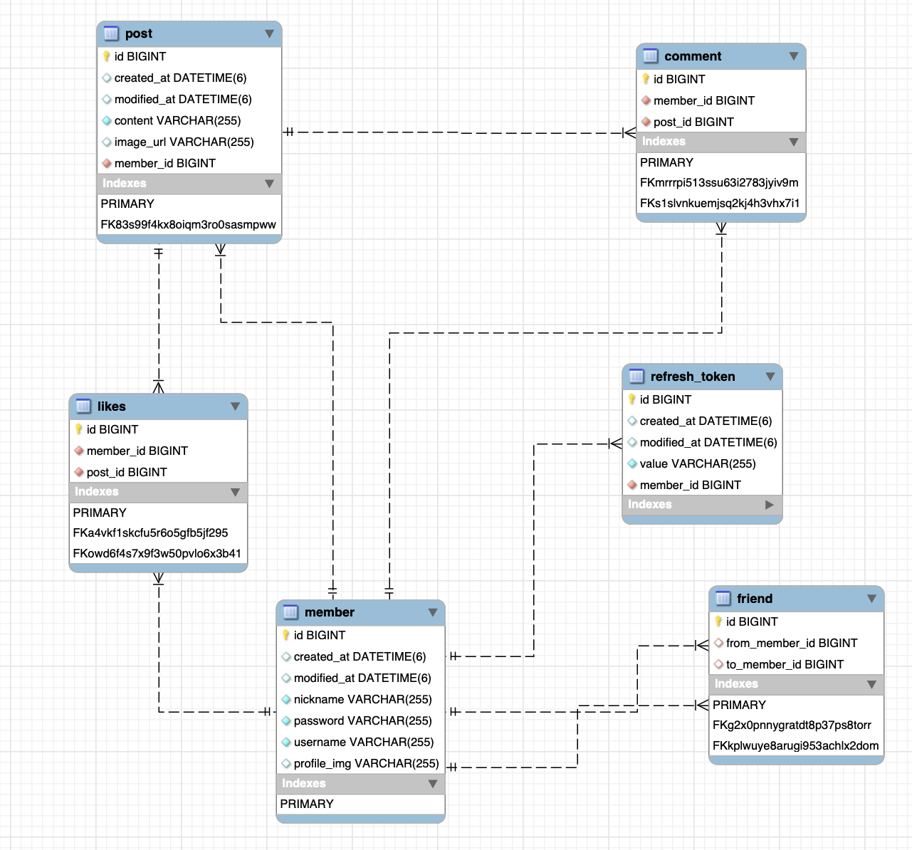
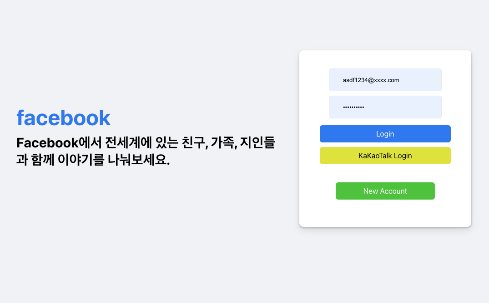
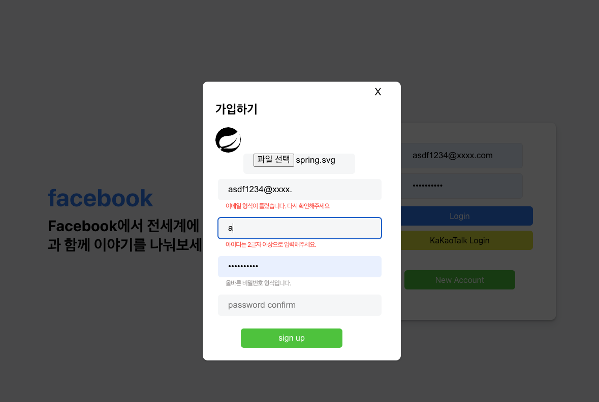
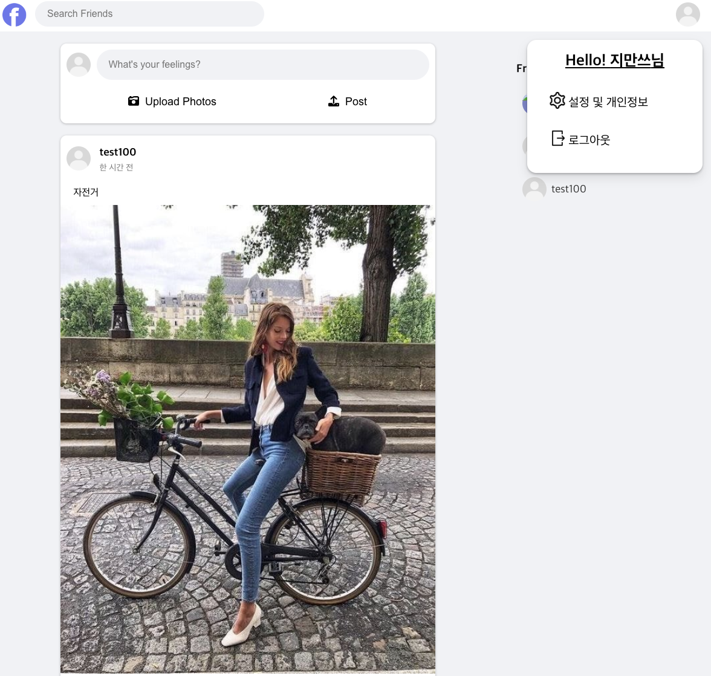
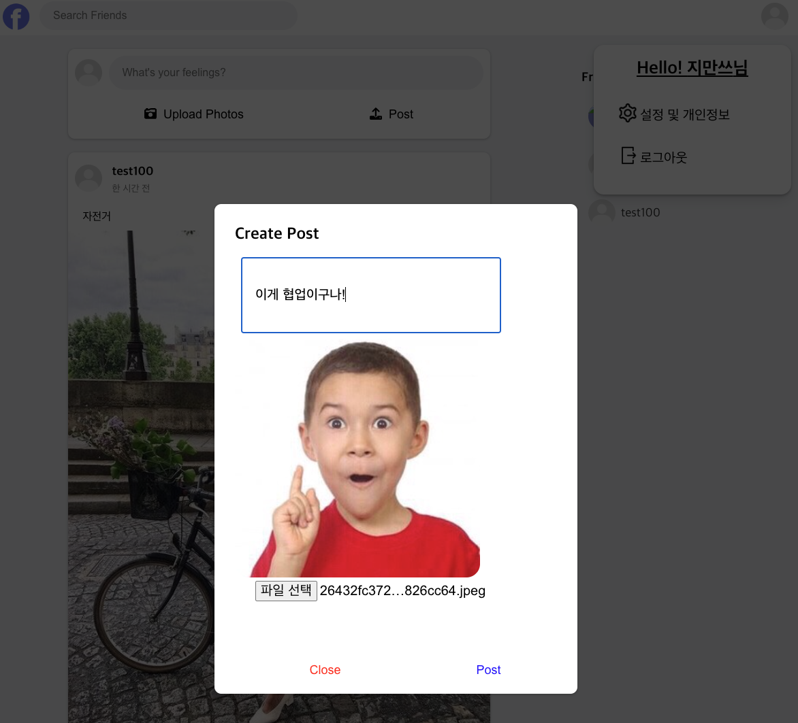
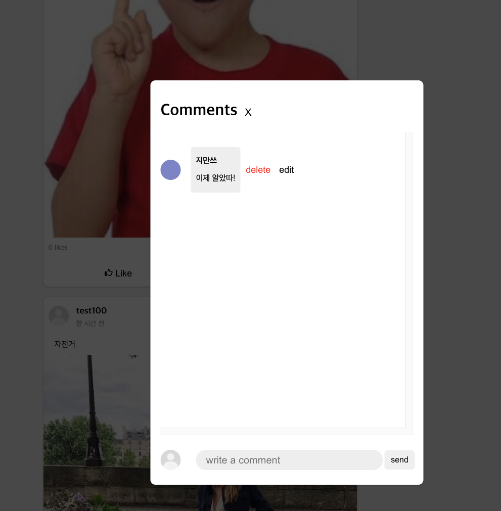

# focebak

*not for commercial use

## ****🤷‍♂️ 프로젝트 목적****
이 프로젝트는 항해99의 클론 프로젝트 과제로 
상업목적이 아닌 개인의 기술역량 강화를 초점으로 만들어졌으며  
나아가 협업을 배우고 백엔드 - 프론트엔드 커뮤니케이션을 익히려는 목적으로 만들어졌습니다.  

## ****🍀 프로젝트 소개****

facebook 클론 프로젝트 입니다.
## ****🗓 프로젝트 기간****

- 2022.08.19 ~ 2022.08.25

## ****⭐️ 팀 구성****

|이름|팀원 깃허브|포지션|
|---|---|---|
|노진서|https://github.com/oneqrhee|Front-end|
|김혜림|https://github.com/hlim9022|Back-end|
|이동건|https://github.com/dongkeon-lee|Back-end|
|황인권|https://github.com/ingwon97|Back-end|
|이지혜|https://github.com/Jhoon2|Front-end|
|전지만|https://github.com/Camof1ow|Back-end|

## ****🛠주요기술****

#### Front-end

 
       
       
      
      

   
      
    
 
   
   

   

#### Back-end

 
      
      
      
   
      
         
       
 
   
      
    
   

    
   
    
   
   
   
   
   

      

## ****💡 ERD****
#### 초기 ERD 설계

#### 완성된 Table 기준 ERD

## ****🖼️ 프로젝트 상세****

#### 1.로그인페이지

-로그인 페이지 입니다. 
-쿠키 검증을 통해 저장된 Access 토큰이 없을 시 로그인 화면으로 연결됩니다..  

#### 1-1. 회원가입 창

- 가입시 프로필 사진을 업로드 할 수 있습니다.
- 입력 값을 통해 유효성 검사를 실시간으로 보여줍니다. 

#### 2.메인페이지

-메인페이지 입니다.. 
-등록된 친구의 작성글들을 리스트로 보여줍니다..  
-등록된 게시글은 본인만 삭제할 수 있도록 하였습니다.

#### 3.게시글 등록

-게시글 등록창입니다. 
-사진과 함께 게시글 작성이 가능합니다.  

#### 4.댓글창

-댓글 모달창 입니다.. 
-게시글에 작성된 작성된 댓글을 확인 가능합니다..  

## REPOSITORIES
- BACK-END

[GitHub - Camof1ow/clone_project: 항해99 7주차 팀과제](https://github.com/Camof1ow/clone_project)

- FRONT-END

[GitHub - bennoholik/facebook-clone: 항해99 7주차 팀과제](https://github.com/bennoholik/facebook-clone)  
